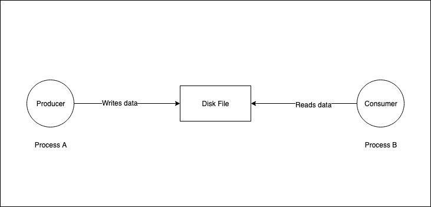
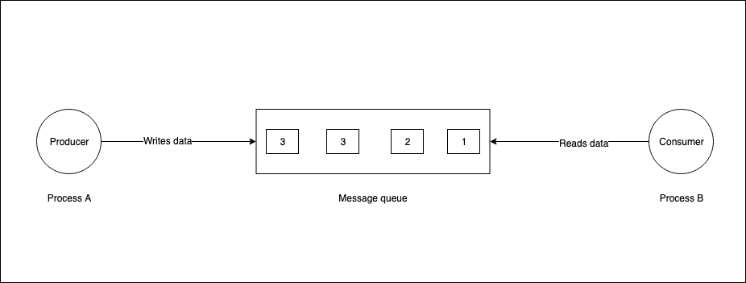

---

title: "IPC"
theme : "blood"
enableMenu: "true"
highlightTheme : "railscasts"
transition: "concave"

---

What is in store for today?

--

1. Why and what's IPC ?
2. Shared storage
3. Pipes
4. Message queues
5. Sockets
6. Signals

---

# IPC???

--

Humans are social animals and communication is really important

--


--

To generalize, communication is important to get to know what the other person wants to tell and to convey your thoughts as well

--

I am not an expert with Human communication, so let us look at how processes communicate with each other in this video.

--

IPC : Inter Process Communication

--

Let us move on to the different modes/methods of communication for processes

---

# Shared storage

--

## 1. Shared Files

--



--

Thought about Race condition?

--

What happens when the producer and the consumer access the file at the same time? </br>
The outcome can be an intermediate result in this case!

--


--

This is why we need file locks.

--

Conditions for a lock:
- Producer should gain an **exclusive** lock on the file, before writing to it.
- A consumer should gain a **shared** lock on the file before reading from it. 
- Exclusive locks can be held by "atmost" one process at a time.
- Multiple readers can hold a shared lock at the same time. 
- No process can write to a file if any process holds a shared lock on the file.

--

Disk read and writes are considered slow and thus this IPC method is not a viable solution with time critical applications.

--

## 2. Shared Memory

--

Since reads and writes on files are slow, the next best option is to move it to the memory(RAM)

--

We use semaphores instead of file locks to optimize speeds for coordination of access in the shared memory.

--

Let us take a look at how a generic semaphore works!
- Assume you have a bike rental shop and own a total of 10 bikes.
- The semaphore value is initialized to 0
- If someone borrows a bike, the semaphore increments its value by 1.
- If someone returns a bike, the semaphore decrements its value by 1.
- If the semaphore value is 9, it does not let anyone borrow a bike until someone returns a bike(inturn decreasing the semaphore to 8).

--

We do not want more than one process to write to a file, hence we use a binary semaphore(values 0,1)

--

How does this semaphore help in our shared memory IPC?
- It's value is initialized to 0.
- A process can write to the shared mem, when the semaphore is 0.
- After the write completes, the semaphore value is increased to 1.
- A process will be allowed to read from a file only when the semaphore value is set to 1.

--

Major drawback of using shared storage:
- This method does not work well with processes that exchange data streams.

---

# Pipes:

--

What comes to your mind when you hear the word pipe?

--


--

**I hope it is definitely not this one!!**

--

This is what you should be thinking about

--


--

What do you understand by this?

--

We have a producer at one end and consumers at the other end.

--

As producer keeps producing data, it passes through the pipe and reaches the consumers in a FIFO(First In First Out) manner.

--

## 1. Unnamed pipes

--

```$ sleep 5 | echo "Hello, world!"``` </br> </br>
Writer to the left of "|" and reader to the right

--

Exercise for you:
```Why does "Hello, world!" get printed before the writer(sleep 5) exits?```
</br></br></br></br>
Put your answers in the comments section of this video!

--

Here is another example:

```
$ cat test.dat
this
is
the
way
the
world
ends
$ cat test.dat | sort | uniq # returns immediately
$ cat test.dat | sleep 5 | sort | uniq # see what happens!
```

--

Hence, unnamed pipes can be used for 1 producer and 1 consumer!

--

Storage of data in unnamed pipes:
- The system maintains an in-memory buffer for unnamed pipes. - There is no file present on the disk for this communication.
- Once the reader and writer terminate, the buffer is reclaimed.

--

## 2. Named pipes

--

Steps to see the working of a named pipe:
- Open two terminals in the same working directory.
- In terminal 1:
    - $ mkfifo aditya
    - $ cat aditya
- In terminal 2:
    - $ cat > aditya
    - (Enter some random data here and see it reflect in terminal 1)
- Clean up by unlinking the named pipe.
    - $ unlink aditya

--

Remember that we can have multiple producers and consumers for named pipes.

---

# Message Queues

--

What do you think is a problem with pipes? 🤔

--

Pipes have a strict FIFO behavior. The first byte written is the first byte read.

--

Message queues are a sequence of messages with two parts:
- The payload, which consists of the actual data.
- Type of the message for ease of retrieval. (An integer)

--

 </br>
Messages can be consumed based on the type of message.

--

As we can see, pipes and message queues are meant to be used as unidirectional message passers.</br></br>
Even though bi-directional named pipes exist, it makes more sense to keep them simple and use unidirectional itself.

---

# Sockets

--

Two variants:
- IPC sockets (On the same host) - a.k.a Unix sockets
- Network sockets (Between hosts on a reachable network)

--

Sockets configured as streams are bi-directional by default.

--

What would be a good example of IPC over sockets?

--

Yes, a web server and client which tries to connect to it.

--

There are two majorly used network socket types:
- Stream sockets (for TCP)
- Dgram sockets (for UDP)

--

Any idea why only stream network sockets are bi-directional?

--

- TCP uses something called 3 way handshake to establish a connection and then streams data through the connection.
- UDP just sends data and forgets about it. </br></br>
Watch this video if you want to know more about the TCP 3 way handshake: https://youtu.be/L6tePc9Pqxw

--

Here is one quick question. How would you go about using a network socket as a Unix socket? </br></br>
Put your answer in the comment section below.

---

# Signals

--

A signal is used to interrupt a running process. 

--

Signals when handled properly, can be used in the form of IPC.
(Except for SIGSTOP and SIGKILL)

--

Example Ctrl+c generates a SIGTERM signal and it can be handled to gracefully exit from the process.

---

Thank you!
